Separate the work and life?

## Entertainment

### Fallout 4

A great game, I think. Especially when I could set to easy mode, except for the beast, no one can hold me up. Well, until I met some tough guys carried with gun.

After I checked the trophy guide from PSNProfile, I started to learn that it's very hard to achieve the platinum. So I would aim to clear the story for now.

## Learning

### nsenter

I did few challenges from iximiuz courses, the one of finding out the container ip really costed me a lot of times, because there was no relative cmd in the container. And after such a long time not reaching out cloud-native stuffs, I hardly could recall any approach.

Even after I find the cmd of `nsenter`, because of the unfamiliarity, I spent quite a lot of time to really get into the network namespace, by using the option of `-t`.

`nsenter -t pid -n`

## Life

- a pure indoor-ha right now, why bother getting out
- spent pretty much time on games this week in spite of I already stopped to play other mobile games
- the 祭りと花火大会 was a bit disappointing, nothing like the performance from animations

## Collectibles

### share

- https://nouptime.com/
  - best service ever existed, 100% guaranteed ✅
- https://www.jpl.nasa.gov/news/nasas-curiosity-rover-discovers-a-surprise-in-a-martian-rock
  - 
- https://brycemecum.com/2023/03/31/til-mermaid-tracing/
  - mermaid with gantt graph
- 剃刀
  - 能解释为愚蠢的，就不要解释为恶意。
  - 能解释为无知的，就不要解释为愚蠢。
  - 能解释为可原谅的错误的，就不要解释为无知。
  - 能用你未知的其他原因解释的，就不要解释为错误。
  - 能用一群人在复杂系统中的互动解释的，就不要解释为恶意或者愚蠢。
  - 能解释为情绪的，就不要解释为策略。
- https://www.youtube.com/watch?v=3YRrVzxs9m8 - 如何管理预期
- https://www.youtube.com/watch?v=t4vSzN2QDrE - 草台班子是如何运行的？
- https://www.youtube.com/watch?v=j6DagWhZwFo - 如何避免各种“瘾”火烧身？

```mermaid
gantt
    title Example Starfish Trace
    dateFormat x
    axisFormat %S.%L

    section Frontend
    /checkout                                        :crit, 0, 1500ms
    GET /api/session                                 :150, 170ms
    POST /api/analytics                              :190, 70ms
    GET /api/checkout/state                          :200, 500ms
    GET /api/checkout/cart                           :1100, 140ms
    App                                              :1300, 180ms
    POST /api/analytics                              :done, 1450, 70ms
    GET /assistant/poll                              :done, 1450, 120ms
    POST /api/analytics                              :done, 1580, 70ms

    section API Service
    /api/checkout/state                              :crit, 240, 440ms
    cache.get session#58;[redacted]                  :360, 10ms
    db.query select from session                     :370, 20ms
    db.query select from user                        :390, 20ms
    db.query select from checkout                    :410, 20ms
    http.request GET http#58;//payments/poll  :450, 210ms
    thread.spawn refresh-checkout-cache              :done, 670, 220ms

    section Payment Service
    /poll                                            :crit, 470, 180ms
    db.query select from payment                     :490, 30ms
    db.query update payment                          :530, 60ms
```

### learn

- https://www.jvt.me/posts/2024/07/12/things-know-commits/
  - `git reflog`
  - `git commit -m sq`
- self improvement - https://www.quora.com/profile/Momenul-Ahmad/The-17-Laws-of-Self-Improvement
  - self awareness - understand your strengths and weaknesses
  - discipline - stay committed to your goals
  - gratitude - appreciate what you have
  - patience - allow time for growth and progress
  - resilience - bounce back from setbacks
  - focus - concentrate on your priorities
  - health - maintain physical and mental well-being
  - networking - build meaningful connections
  - creativity - embrace and cultivate your creative side
  - adaptability - be flexible and open to change
  - mindfulness - stay present and aware
  - generosity - give back and help others
  - confidence - believe in your abilities
  - integrity - act with honesty and ethics
  - goal setting - define and pursue your objectives
  - consistency - keep a steady persistent approach
- stoic lessons
  - life is about managing your reactions
  - misfortune is fortune
  - thinking about loss makes your tougher
  - guard your mind vigorously
  - embrace amor fati (love of one's fate)
- https://medium.com/@RoussiAbel/optimizing-java-base-docker-images-size-from-674mb-to-58mb-c1b7c911f622
  - jdeps & jlink
