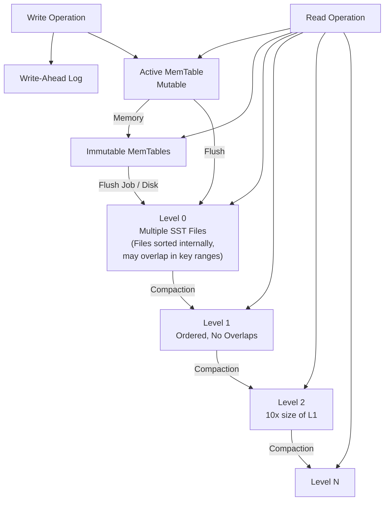

## what is rocksdb

RocksDB is a storage engine with key/value interface, where keys and values are arbitrary byte streams, which means we could use rocksdb to persist our data in memory at ease.

a sample from official [simple_example.cc](https://github.com/facebook/rocksdb/blob/main/examples/simple_example.cc)

```c
int main() {
  DB* db;
  Options options;
  // Optimize RocksDB. This is the easiest way to get RocksDB to perform well
  options.IncreaseParallelism();
  options.OptimizeLevelStyleCompaction();
  // create the DB if it's not already present
  options.create_if_missing = true;

  // open DB
  Status s = DB::Open(options, kDBPath, &db);
  assert(s.ok());

  // Put key-value
  s = db->Put(WriteOptions(), "key1", "value");
  assert(s.ok());
  std::string value;
  // get value
  s = db->Get(ReadOptions(), "key1", &value);
  assert(s.ok());
  assert(value == "value");

  // atomically apply a set of updates
  {
    WriteBatch batch;
    batch.Delete("key1");
    batch.Put("key2", value);
    s = db->Write(WriteOptions(), &batch);
  }

  s = db->Get(ReadOptions(), "key1", &value);
  assert(s.IsNotFound());

  db->Get(ReadOptions(), "key2", &value);
  assert(value == "value");

  {
    PinnableSlice pinnable_val;
    db->Get(ReadOptions(), db->DefaultColumnFamily(), "key2", &pinnable_val);
    assert(pinnable_val == "value");
  }

  {
    std::string string_val;
    // If it cannot pin the value, it copies the value to its internal buffer.
    // The intenral buffer could be set during construction.
    PinnableSlice pinnable_val(&string_val);
    db->Get(ReadOptions(), db->DefaultColumnFamily(), "key2", &pinnable_val);
    assert(pinnable_val == "value");
    // If the value is not pinned, the internal buffer must have the value.
    assert(pinnable_val.IsPinned() || string_val == "value");
  }

  PinnableSlice pinnable_val;
  s = db->Get(ReadOptions(), db->DefaultColumnFamily(), "key1", &pinnable_val);
  assert(s.IsNotFound());
  // Reset PinnableSlice after each use and before each reuse
  pinnable_val.Reset();
  db->Get(ReadOptions(), db->DefaultColumnFamily(), "key2", &pinnable_val);
  assert(pinnable_val == "value");
  pinnable_val.Reset();
  // The Slice pointed by pinnable_val is not valid after this point

  delete db;

  return 0;
}
```

## core concepts

The fundamental components of RocksDB are the MemTable, SSTable, and Write-Ahead Log (WAL). Whenever data is written to RocksDB, it's added to an in-memory write buffer called the MemTable, and it also supports configurable synchronous logging to the Write-Ahead Log (WAL) on disk. The WAL is primarily used for data durability and crash recovery in case of system failures. The MemTable is by default implemented using a Skip List, which allows it to keep data ordered with insertion and search costs of O(log n).

1. mem-table & SSTables
2. WAL
3. compaction


## signature work flow



### write path

1. (active) memtable
2. append WAL (restart, restore)
3. once the active memtable becomse full, it is marked as immutable and a new active memtable is created, and the immutable ones are queued for flushing to disk
4. immutable memtables are flushed to disk as one or more level 0 SST files (each level 0 file is sorted internally, but key ranges may overlap with other level-0 files)
5. possible compaction if the number of SST files reach a certain threshold (4 by default)

### read path

1. Search the active memtable.
2. Search immutable memtables.
3. Search all SST files on L0 starting from the most recently flushed.
4. For L1 and below, find a single SST file that may contain the key and search the file.

## pondering problems

### why compaction is a must

Because LSM Trees convert all data modification operations into **append-only writes**: an insert writes a new data entry, an update writes a modified entry, and a delete writes a tombstone marker—reading data, if not found in memory, requires searching through SSTable files starting from Layer 0. If there are many duplicate entries, this can lead to **read amplification**. Therefore, Compaction operations are used to merge data in lower layers and clean up marked-for-deletion data, thereby reducing the impact of amplification factors.

three kinds of aimpilication:

- space -- occupy more space than the raw data (append-only strategy)
- read -- worst O(n)
- write -- worst trigger multiple layer (flush) compaction

### compaction strategies (ClaudeAI )

RocksDB offers multiple compaction strategies to optimize for different workloads and access patterns. The choice of compaction strategy significantly impacts the three amplification factors (space, read, write).

#### Leveled Compaction (Default)

The most commonly used strategy that maintains strict ordering across levels:

```sh
Level 0: [SST1] [SST2] [SST3] [SST4]  (may overlap)
Level 1: [SST5] [SST6] [SST7]         (no overlap, 10MB total)
Level 2: [SST8] [SST9] ... [SST15]    (no overlap, 100MB total)
Level 3: [SST16] ... [SST25]          (no overlap, 1GB total)
```

**Characteristics:**

- Each level (except L0) has non-overlapping key ranges
- Each level is ~10x larger than the previous level
- L0 → L1 compaction merges overlapping files
- L1+ compactions merge one file from upper level with overlapping files from lower level

**Trade-offs:**

- ✅ **Read amplification**: O(log N) - only need to check one file per level
- ✅ **Space amplification**: ~1.11x - minimal extra space
- ❌ **Write amplification**: High - data gets rewritten multiple times as it moves down levels

**Best for:** Read-heavy workloads, range queries, when storage space is premium

#### Universal Compaction

Designed to minimize write amplification by keeping fewer levels:

```sh
Level 0: [SST1] [SST2] [SST3] [SST4]
Level 1: [Large_SST1] [Large_SST2]
```

**Characteristics:**

- Files within each level are sorted by age (newest first)
- Compaction triggers based on size ratios and file count
- May compact entire levels at once
- More flexible triggering conditions

**Trade-offs:**

- ✅ **Write amplification**: Lower - less frequent major compactions
- ✅ **Space amplification**: Better for write-heavy workloads
- ❌ **Read amplification**: Higher - may need to check multiple files per level
- ❌ **Temporary space**: Requires more temporary disk space during compaction

**Best for:** Write-heavy workloads, when write performance is critical

#### FIFO Compaction

Simplest strategy that treats the database as a circular buffer:

```sh
Level 0: [SST1] [SST2] [SST3] [SST4] → [Delete oldest when size limit reached]
```

**Characteristics:**

- Only keeps data within a time window or size limit
- Deletes entire SST files when limits are exceeded
- No actual compaction/merging occurs
- Data automatically expires

**Trade-offs:**

- ✅ **Write amplification**: Minimal - no data rewriting
- ✅ **Space amplification**: Predictable - bounded by configured limits
- ❌ **Data retention**: Limited - old data gets deleted
- ❌ **Read performance**: May degrade over time

**Best for:** Time-series data, caching use cases, when data has natural expiration

#### Configuration Examples

```cpp
// Leveled Compaction (default)
Options options;
options.compaction_style = kCompactionStyleLevel;
options.level0_file_num_compaction_trigger = 4;
options.max_bytes_for_level_base = 256 * 1024 * 1024; // 256MB
options.max_bytes_for_level_multiplier = 10;

// Universal Compaction
options.compaction_style = kCompactionStyleUniversal;
options.compaction_options_universal.size_ratio = 1;
options.compaction_options_universal.min_merge_width = 2;

// FIFO Compaction
options.compaction_style = kCompactionStyleFIFO;
options.compaction_options_fifo.max_table_files_size = 1024 * 1024 * 1024; // 1GB
```

#### Choosing the Right Strategy

| Workload Pattern     | Recommended Strategy | Reasoning                                      |
| -------------------- | -------------------- | ---------------------------------------------- |
| Read-heavy OLTP      | Leveled              | Low read amplification, good for point lookups |
| Write-heavy logging  | Universal or FIFO    | Lower write amplification                      |
| Time-series data     | FIFO                 | Natural data expiration, minimal overhead      |
| Mixed workload       | Leveled (tuned)      | Balance between read/write performance         |
| Cache/temporary data | FIFO                 | Automatic cleanup, predictable space usage     |

The key is to understand your access patterns and optimize for the most critical amplification factor in your use case.

## references

- https://deepwiki.com/facebook/rocksdb/1-overview
- https://github.com/facebook/rocksdb/wiki/RocksDB-Overview
- https://www.luozhiyun.com/archives/842
- https://artem.krylysov.com/blog/2023/04/19/how-rocksdb-works/
- https://www.scylladb.com/2018/01/17/compaction-series-space-amplification/
- https://www.scylladb.com/2018/01/31/compaction-series-leveled-compaction/
