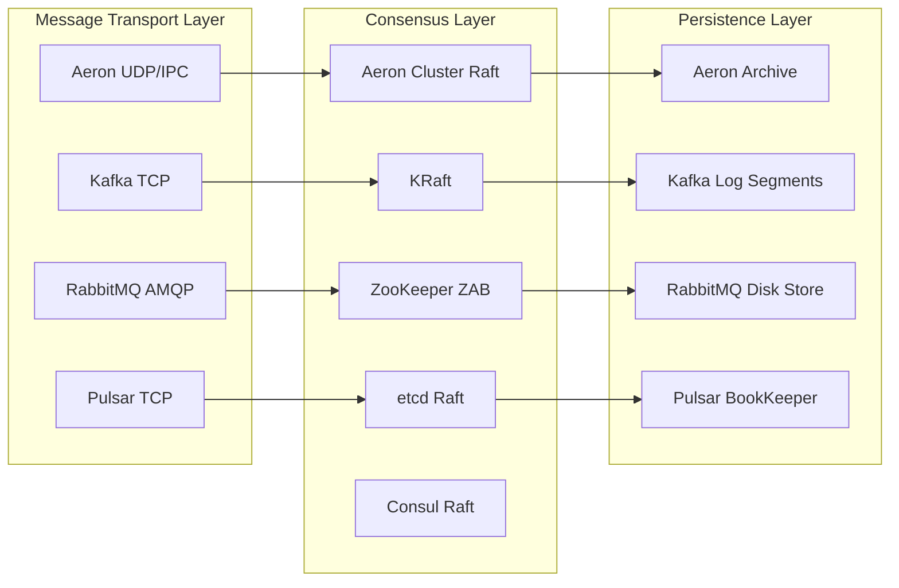
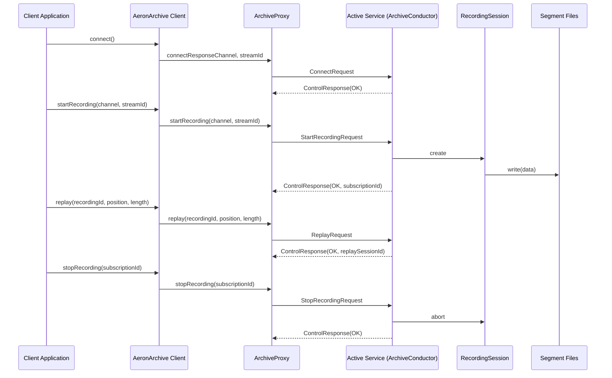

Aeron is an efficient reliable UDP unicast, UDP multicast, and IPC message transport.

## why using aeron cluster

key advantages:

1. ultra-low latency & high throughput (UDP/IPC)
2. zero-copy architecture (tryClaim with shared memory)
3. integrated stack benefits (transport, archive, cluster)

comparing with other popular architectures



## how to communicate -- transport

**A design goal for Aeron is to be the highest throughput with the lowest and most predictable latency of any messaging system.**

UDP is used when the processes are on different machines. IPC is used when they're on the same machine.

### overview

this is how the publication from machine-1 gets subscribed by machine-2 with multiple publications & multiple subscriptions.

- exclusivePublication only for one session
- shareablePublication can be held by multiple AeronClients
- one publication could be subcribed multiple times
  - read data from the same image log-buffer
  - **tip**: take the flow control and hwm stuffs into considerations


### MediaDriver

By default, Aeron Transport creates files below the `/dev/shm` directory on Linux systems.

- `cnc.dat` stores control and response for client-conductor and media driver conductor; also other interal states (counters, positions)
- `loss-report.dat` any message loss for Network Publications
- `images` on receiver side, log buffer
- `publications` on sender side, log buffer

```yaml
- /dev/shm/sakura-node
  - cnc.dat
  - loss-report.dat
  - images
  - publications
```

## persistency -- archive

Aeron Archive builds on top of Aeron Transport - it allows the streams of messages sent through Aeron to be captured and recorded to disk, so they can be replayed later.

### overview

Archive on the subscription side, spy data from image logbuffer for recording, also a demostration of replay data from Archive.

lets take machine-1 as `10.110.0.1`, and machine-2 as `10.110.0.2`

```java
// publication
aeron.addExclusivePublication("10.110.0.2:9010", 3939);

// subscription
aeron.addSubscription("10.110.0.2:9010", 3939);

// recording
aeronArchive.startRecording("10.110.0.2:9010", 3939, SourceLocation.LOCAL);

// replaying, we assume this specific recording will get the correlationId 0
// public long startReplay(recordingId, position, length, replayChannel, replayStreamId) {}
aeronArchive.startReplay(0, 0, Long.MAX_VALUE, "10.110.0.2:9110", 4939);
```


```yaml
- /data/sakura-node/archive
  - 0-$offset.rec
  - $counter-0.rec
  - archive.catalog
  - archive-mark.dat
```

- {recordingId}-{segmentFileBasePosition}.rec
  - All the Segment files for a particular Recording have the same fixed length. The length must be a power of 2 between 64 KB and 1 GB inclusive and must hold at least one Term from the Publication being recorded (the default length is **128 MB**).
  - recordingId was maintained inside `Archive`, `Catalog#addNewRecording`
- archive.catalog
  - contains a series of RecordingDescriptor records
  - [aeron-archive-codecs.xml](https://github.com/real-logic/aeron/blob/master/aeron-archive/src/main/resources/archive/aeron-archive-codecs.xml)
- archive-mark.dat
  - to guard the archive directory so that only one instance of Aeron Archive can use it at a time

### control flow



### ArchivingMediaDriver

- the authentic media driver
- archive -- `ArchiveConductor`
  - recorder
    - `RecordingSession`
  - replayer
    - `ReplaySession`
  - sessionWorker `Session`
- catalog -- keeps details of recorded images, past and present, and used for browsing

```java
    ArchivingMediaDriver(final MediaDriver driver, final Archive archive)
    {
        this.driver = driver;
        this.archive = archive;
    }
```

## consensus -- cluster

### overview

```yaml
- /data/sakura-node/consensus-module
  - cluster-mark.dat
  - node-state.dat
  - recording.log
```

### ClusteredMediaDriver

- the authentic media driver
- archive (persistency) `ArchiveConductor`
- consensusModule (raft implementation), the beast `ConsensusModuleAgent`

```java
    ClusteredMediaDriver(final MediaDriver driver, final Archive archive, final ConsensusModule consensusModule)
    {
        this.driver = driver;
        this.archive = archive;
        this.consensusModule = consensusModule;
    }
```

## how to debug & solve problems

TODO

## references

- https://raft.github.io/
- https://deepwiki.com/aeron-io/aeron
- https://aeron.io/docs/aeron-cluster/overview/
- https://theaeronfiles.com/
