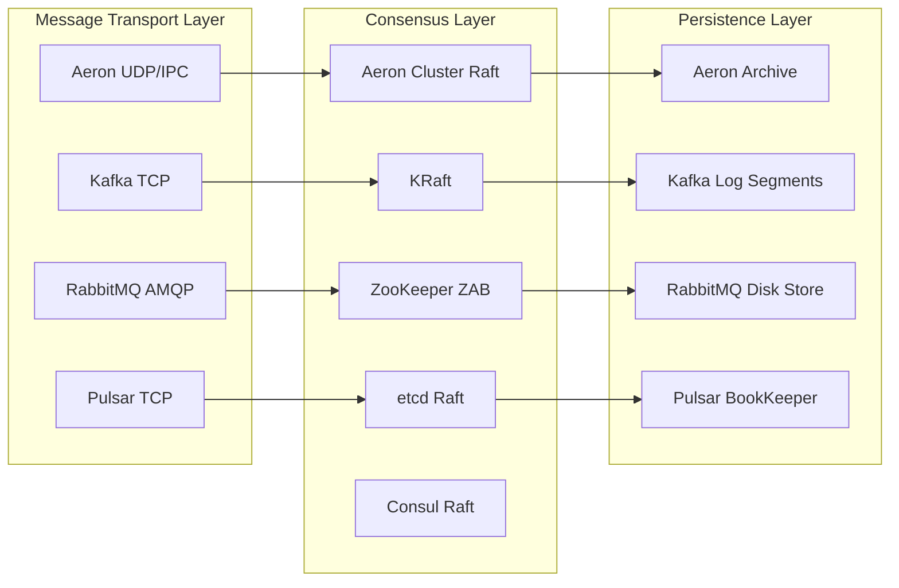
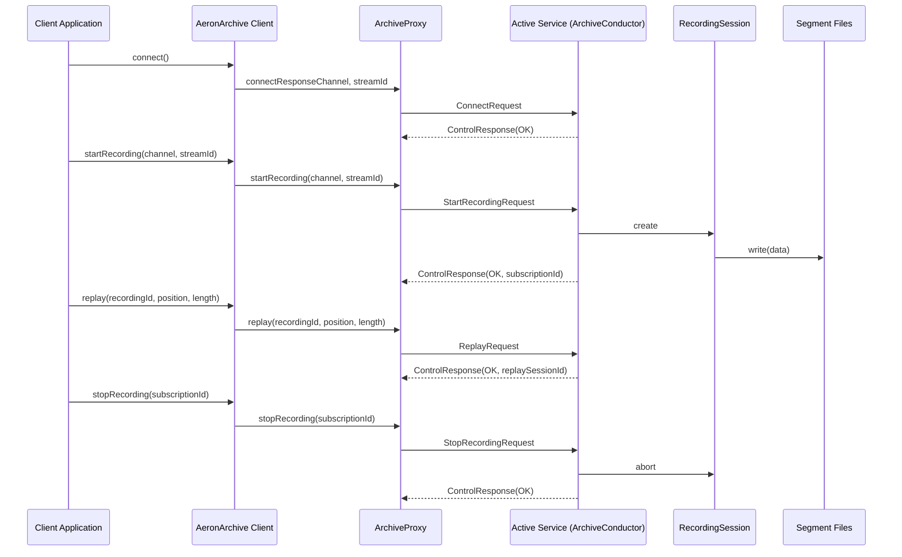
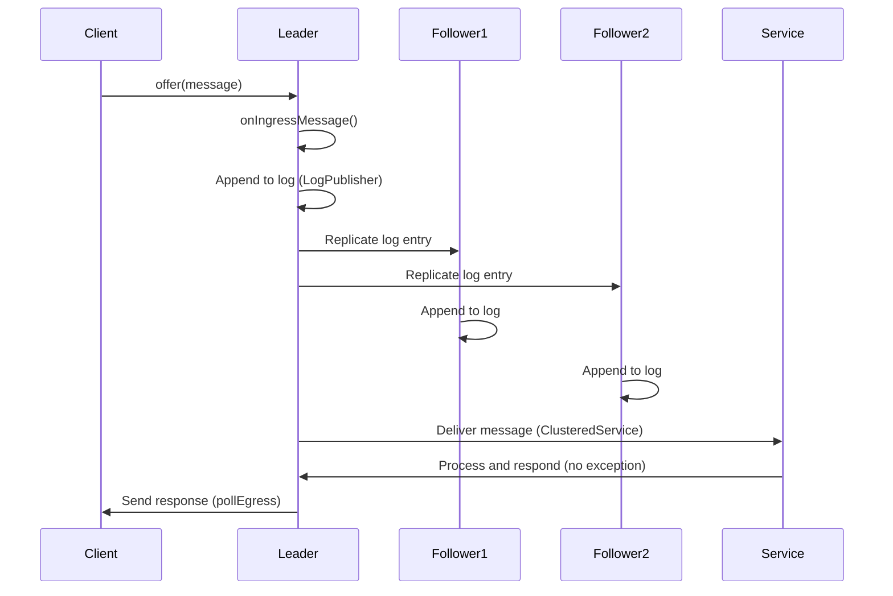

Aeron is an efficient reliable UDP unicast, UDP multicast, and IPC message transport.

## why using aeron cluster

key advantages:

1. ultra-low latency & high throughput (UDP/IPC)
2. zero-copy architecture (tryClaim with shared memory)
3. integrated stack benefits (transport, archive, cluster)

comparing with other popular architectures



## the authentic basic rule in aeron

`Agent` which follows Actor Model and Single-Threaded event loop.

correlationId is critical, too; the agent simply knows how to doWork, but doesn't know what's the data for.

- MediaDriver -- DriverConductor
- ArchivingMediaDriver -- ArchiveConductor
- ConsensueModule -- ConsensueModuleAgent, ClusteredServiceAgent

## how to communicate -- transport

**A design goal for Aeron is to be the highest throughput with the lowest and most predictable latency of any messaging system.**

UDP is used when the processes are on different machines. IPC is used when they're on the same machine.

~to me, aeron transport was some kind of TCP built upon UDP.~

### overview

this is how the publication from machine-1 gets subscribed by machine-2 with multiple publications & multiple subscriptions. You can check the full walk through at theaeronfiles.

- exclusivePublication only one publication instance (session)
- shareablePublication can be held by multiple publication instances
- a publication could be subcribed multiple times
  - read data from the same image log-buffer


```java
// machine-1, exclusive publication
var pub = aeron.addExclusivePublication("10.110.0.2:9010", 3939);
pub.offer(xxx, xxx, xxx);

// machine-2, multiple subscriptions
var sub1 = aeron.addSubscription("10.110.0.2:9010", 3939);
var sub2 = aeron.addSubscription("10.110.0.2:9010", 3939);
```

### MediaDriver

By default, Aeron Transport creates files below the `/dev/shm` directory on Linux systems. aka SharedMemory.

- `cnc.dat` stores control and response for client-conductor and media driver conductor; also other interal states (counters, positions)
- `loss-report.dat` any message loss for Network Publications
- `images` on receiver side, log buffer
- `publications` on sender side, log buffer

```yaml
- /dev/shm/sakura-node
  - cnc.dat
  - loss-report.dat
  - images
  - $correlationId.logbuffer
  - publications
  - $correlationId.logbuffer
```

## persistency -- archive

Aeron Archive builds on top of Aeron Transport - it allows the streams of messages sent through Aeron to be captured and recorded to disk, so they can be replayed later.

### overview

Archive on the subscription side, spy data from image logbuffer for recording, also a demostration of replay data from Archive.

lets take machine-1 as `10.110.0.1`, and machine-2 as `10.110.0.2`

```java
// publication
aeron.addExclusivePublication("10.110.0.2:9010", 3939);

// subscription
aeron.addSubscription("10.110.0.2:9010", 3939);

// recording
aeronArchive.startRecording("10.110.0.2:9010", 3939, SourceLocation.LOCAL);

// replaying, we assume this specific recording will get the correlationId 0
// public long startReplay(recordingId, position, length, replayChannel, replayStreamId) {}
aeronArchive.startReplay(0, 0, Long.MAX_VALUE, "10.110.0.2:9110", 4939);
```


aeron archive file structure.

- {recordingId}-{segmentFileBasePosition}.rec
  - All the Segment files for a particular Recording have the same fixed length. The length must be a power of 2 between 64 KB and 1 GB inclusive and must hold at least one Term from the Publication being recorded (the default length is **128 MB**).
  - recordingId was maintained inside `Archive`, `Catalog#addNewRecording`
- archive.catalog
  - contains a series of RecordingDescriptor records
  - [aeron-archive-codecs.xml](https://github.com/real-logic/aeron/blob/master/aeron-archive/src/main/resources/archive/aeron-archive-codecs.xml)
- archive-mark.dat
  - to guard the archive directory so that only one instance of Aeron Archive can use it at a time

```yaml
- /data/sakura-node/archive
  - 0-$offset.rec
  - $counter-0.rec
  - archive.catalog
  - archive-mark.dat
```

### control flow



### ArchivingMediaDriver

- the media driver in Archive
- archive -- `ArchiveConductor`
  - recorder
    - `RecordingSession`
  - replayer
    - `ReplaySession`
  - sessionWorker `Session`
- catalog -- keeps details of recorded images, past and present, and used for browsing

```java
    ArchivingMediaDriver(final MediaDriver driver, final Archive archive)
    {
        this.driver = driver;
        this.archive = archive;
    }
```

## consensus -- cluster

Aeron Cluster provides an implementation of Raft Consensus upon which highly available services can be built.

Aeron Cluster has the following capabilities:

- sequences multiple client connections into a single, replicated log
- provides efficient fault tolerance with 2 or more nodes (raft definition)
- provides Aeron Archive endpoints for writing to snapshots and reading from snapshots on start (clean and restore)
- allows 1 or more clustered services to be run, with support for inter-service sequenced messaging
  reliable, sequenced timers
- very high levels of performance, in particular with premium features such as kernel bypass when using the C media driver

### overview

sequence of how the client-side data was proceeded in aeron-cluster.



aeron cluster consensus module file structure.

- cluster-mark.dat -- essential metadata, `ClusterTool` reads
  - cluster id
  - member id
  - appointed leader id
  - log position -- current position in the consensus log
  - timestamp -- when the mark file was last updated
    - possible leader timeout
  - cluster members information
- node-state.dat
  - An extensible list of information relating to a specific cluster node.
    - Raft-related State:
      - The current term
      - The votedFor member ID for the current term
      - Information about the log position and leadership term ID for the last committed entry.
    - Recovery Pointers: Pointers to the latest snapshot and the position in the replicated log where recovery should start from if the node restarts.
- recording.log
  - a sequence of log entries that represent the complete history of the cluster's state machine
  - it acts as a metadata catalog for the Aeron Archive, saying it contains termId-recordingId which points to `0-{offset}.rec` files

```yaml
- /data/sakura-node/consensus-module
  - cluster-mark.dat
  - node-state.dat
  - recording.log
  - xxx-error.log
```

### ClusteredMediaDriver

- the media driver
- archive (persistency) `ArchiveConductor`
- consensusModule (raft implementation), the core `ConsensusModuleAgent`
- consensusModule communicates with service, `ClusteredServiceAgent`

```java
    ClusteredMediaDriver(final MediaDriver driver, final Archive archive, final ConsensusModule consensusModule)
    {
        this.driver = driver;
        this.archive = archive;
        this.consensusModule = consensusModule;
    }
```

### ConsensusModuleAgent

```mermaid
graph LR
    CMA["ConsensusModuleAgent<br/>(ConsensusModuleAgent.java)"]

    %% Core Raft State
    CMA --> |"role, state, term"| RS["RaftState<br/>role: Cluster.Role<br/>state: ConsensusModule.State<br/>leadershipTermId: long<br/>logPosition: long"]

    %% Election & Leadership
    CMA --> |"election"| EL["Election<br/>consensusModuleId: int<br/>leaderMember: ClusterMember<br/>candidateTermId: long<br/>isLeaderStartup: boolean"]

    %% Log Replication
    CMA --> |"logReplication"| LR["LogReplication<br/>logPublisher: LogPublisher<br/>appendPosition: long<br/>followerCommitPosition: long<br/>replicationSessionId: long"]

    %% Ingress/Egress
    CMA --> |"ingressAdapter"| CIA["ClusterIngressAdapter<br/>fragmentHandler: IngressFragmentHandler<br/>subscription: Subscription"]
    CMA --> |"egressPublisher"| CEP["EgressPublisher<br/>publication: ExclusivePublication<br/>sessionId: long<br/>streamId: int"]

    %% Service Adapter
    CMA --> |"serviceAdapter"| SA["ServiceAdapter<br/>serviceControlPublisher: ServiceControlPublisher<br/>serviceControlSubscription: Subscription<br/>consensusModuleProxy: ConsensusModuleProxy"]

    %% Archive Integration
    CMA --> |"logPublisher"| LP["LogPublisher<br/>publication: ExclusivePublication<br/>maxPayloadLength: int<br/>sessionId: long"]
    CMA --> |"logAdapter"| LA["LogAdapter<br/>subscription: Subscription<br/>fragmentHandler: FragmentHandler<br/>image: Image"]

    %% Timer Management
    CMA --> |"timerService"| TS["TimerService<br/>wheel: TimerWheel<br/>timeUnit: TimeUnit<br/>resolution: long"]

    %% Session Management
    CMA --> |"sessionByIdMap"| SBM["Int2ObjectHashMap<ClusterSession><br/>ClusterSession.state<br/>ClusterSession.lastCorrelationId<br/>ClusterSession.timeOfLastActivityNs"]

    %% Pending Service Messages
    CMA --> |"pendingServiceMessages"| PSM["ArrayDeque<ServiceMessage><br/>ServiceMessage.buffer<br/>ServiceMessage.offset<br/>ServiceMessage.length"]

    %% Cluster Members
    CMA --> |"clusterMembers"| CM["ClusterMember[]<br/>ClusterMember.id<br/>ClusterMember.clientFacingEndpoint<br/>ClusterMember.memberFacingEndpoint<br/>ClusterMember.logEndpoint<br/>ClusterMember.transferEndpoint<br/>ClusterMember.archiveEndpoint"]

    %% Timers & Timeouts
    CMA --> |"timeouts"| TO["Timeouts<br/>electionTimeoutNs: long<br/>heartbeatTimeoutNs: long<br/>heartbeatIntervalNs: long<br/>leaderHeartbeatIntervalNs: long"]

    %% Archive Context
    CMA --> |"archiveCtx"| AC["AeronArchive.Context<br/>controlRequestChannel: String<br/>controlRequestStreamId: int<br/>controlResponseChannel: String<br/>controlResponseStreamId: int<br/>recordingEventsChannel: String"]

    %% Cluster Context
    CMA --> |"ctx"| CC["ConsensusModule.Context<br/>clusterId: int<br/>serviceCount: int<br/>appointedLeaderId: int<br/>memberEndpoints: String<br/>clusterDir: File<br/>archiveContext: AeronArchive.Context<br/>deleteDirOnStart: boolean"]

    %% Mark File
    CMA --> |"markFile"| MF["ClusterMarkFile<br/>markFileDir: File<br/>clusterId: int<br/>memberId: int<br/>appointedLeaderId: int<br/>serviceId: int<br/>joinPosition: long"]

    %% Aeron Instance
    CMA --> |"aeron"| AER["Aeron<br/>context: Aeron.Context<br/>clientLock: ReentrantLock<br/>isClientConductorFromDriver: boolean"]

    %% Sequence Numbers & Positions
    RS --> |"maintains"| SEQ["Sequence Tracking<br/>expectedAckPosition: long<br/>serviceAckId: long<br/>terminationPosition: long<br/>logServiceSessionId: long<br/>logSubscriptionId: long"]

    %% Election State
    EL --> |"tracks"| ES["Election State<br/>nominations: Int2IntCounterMap<br/>thisMemberPosition: long<br/>appendPosition: long<br/>catchupPosition: long"]

    %% Log Replication Details
    LR --> |"manages"| LRD["Replication Details<br/>nextIndex: long[]<br/>matchIndex: long[]<br/>timeOfLastAppendPositionNs: long<br/>timeOfLastUpdateNs: long"]

    %% Service Control
    SA --> |"controls"| SC["Service Control<br/>ackId: long<br/>serviceId: int<br/>logPosition: long<br/>leadershipTermId: long<br/>timestampNs: long"]

    %% Timer Wheel
    TS --> |"uses"| TW["TimerWheel<br/>currentTick: long<br/>resolution: long<br/>wheel: TimerWheel.Timer[]<br/>timersPerWheel: int"]

    %% Session State
    SBM --> |"contains"| SS["Session State<br/>id: long<br/>responseStreamId: int<br/>responseChannel: String<br/>encodedPrincipal: byte[]<br/>timeOfLastActivityNs: long<br/>correlationId: long"]

    %% Member State
    CM --> |"tracks"| MS["Member State<br/>id: int<br/>clientFacingEndpoint: String<br/>memberFacingEndpoint: String<br/>logEndpoint: String<br/>transferEndpoint: String<br/>archiveEndpoint: String<br/>isLeader: boolean"]

    %% Styling
    classDef agent fill:#e1f5fe,stroke:#01579b,stroke-width:3px
    classDef raft fill:#f3e5f5,stroke:#4a148c
    classDef communication fill:#e8f5e8,stroke:#1b5e20
    classDef storage fill:#fff3e0,stroke:#e65100
    classDef session fill:#fce4ec,stroke:#880e4f
    classDef timer fill:#f1f8e9,stroke:#33691e
    classDef context fill:#f9fbe7,stroke:#827717

    class CMA agent
    class RS,EL,LR,ES,LRD raft
    class CIA,CEP,SA,SC communication
    class LP,LA,AC,MF storage
    class SBM,PSM,SS session
    class TS,TO,TW timer
    class CC,CM,MS,AER,SEQ context
```



## how to debug & solve problems

### official tools

media driver

- AeronStat
- ErrorStat
- StreamStat
- LossStat

Archive & Cluster

- ArchiveTool
  - describe
  - dump
  - errors
  - pid
- ClusterTool
  - list-members
  - recording-log
  - snapshot
  - describe

```bash
# list members
java --add-opens java.base/jdk.internal.misc=ALL-UNNAMED --add-opens java.base/java.util.zip=ALL-UNNAMED -cp /app/aeron-all-*.jar io.aeron.cluster.ClusterTool /app/consensus list-members

# describe /app/archive
java --add-opens java.base/jdk.internal.misc=ALL-UNNAMED --add-opens java.base/java.util.zip=ALL-UNNAMED -cp /app/aeron-all-*.jar io.aeron.archive.ArchiveTool /app/archive describe
```

### what if the last update timestamp in `cluster-mark.dat` is far away

> immediate consequences

1. stale leadership
2. (possible) log position drift

> recovery challenges

1. extended catch-up period
2. snapshot requirements
   1. maybe a full snapshot if the log gap is too large
   2. snapshots are expensive operations that impact cluster performance
   3. may trigger automatic snapshot creation on other nodes

> cluster health impact

1. election disruption
   1. node may vote based on outdated information
   2. could delay or complicate election
   3. may cast votes for candidates that are no longer viable
2. network partition detection issues

## references

- https://raft.github.io/
- https://deepwiki.com/aeron-io/aeron
- https://aeron.io/docs/aeron-cluster/overview/
- https://theaeronfiles.com/
