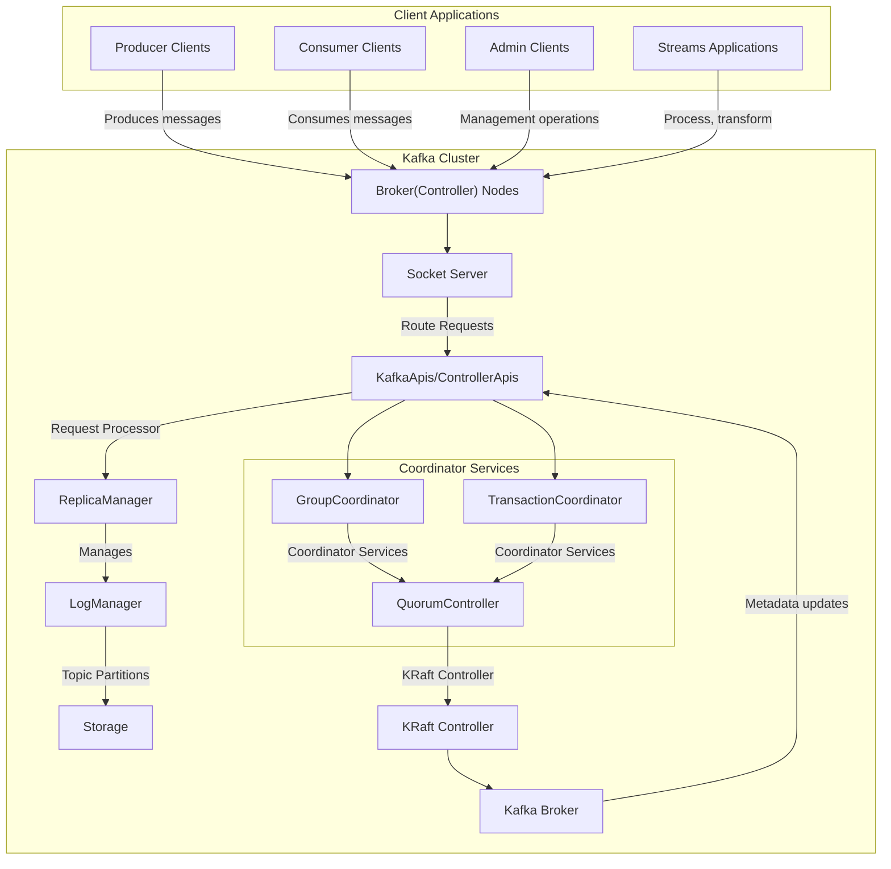
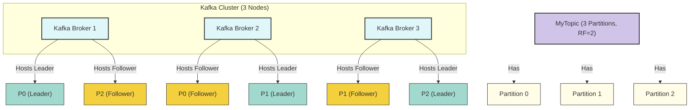
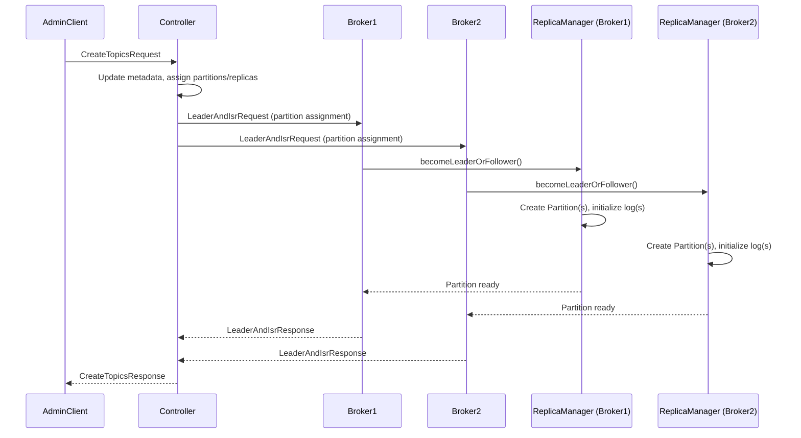
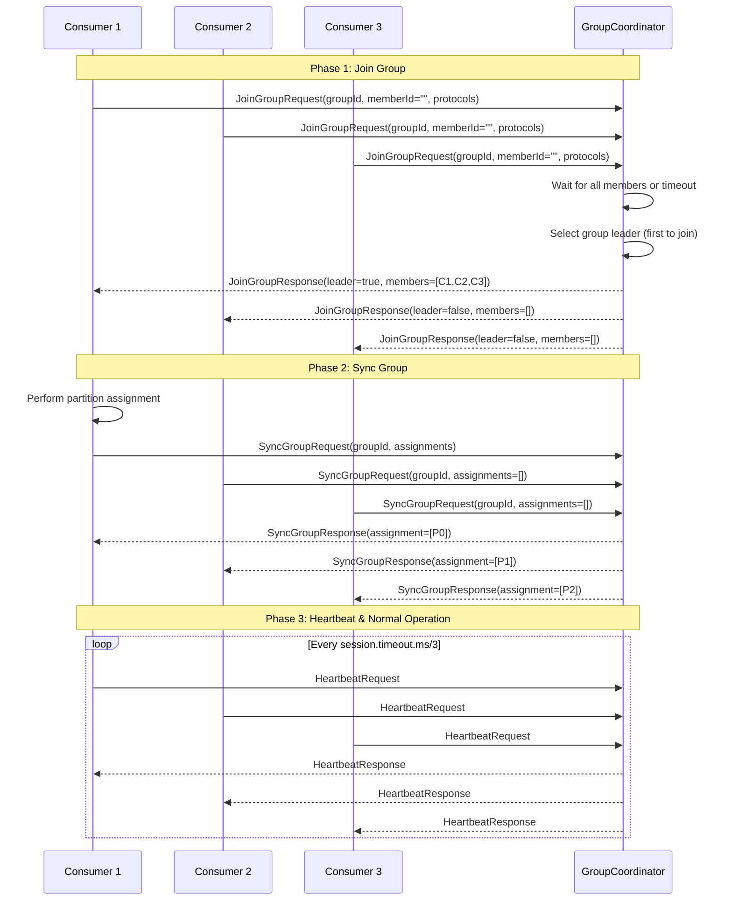
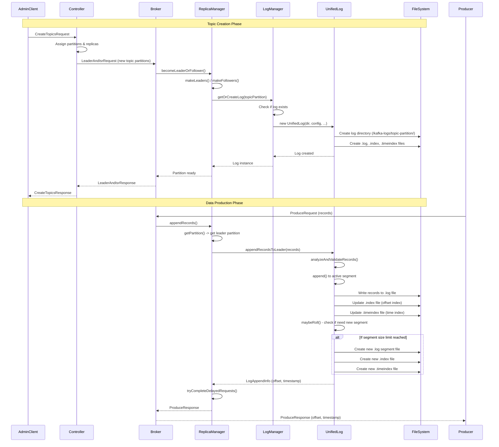
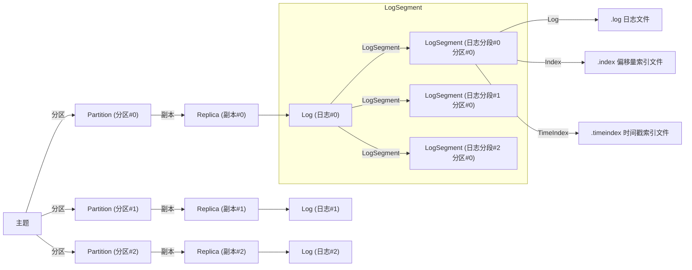
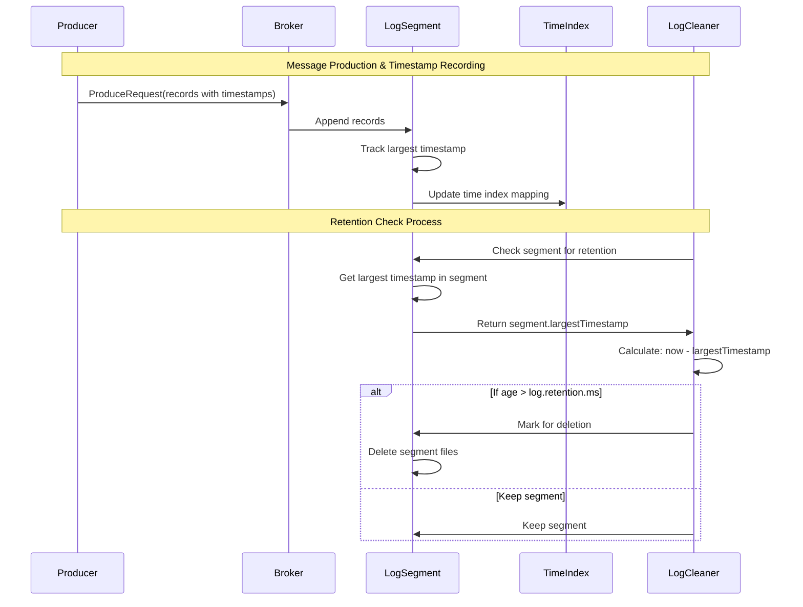
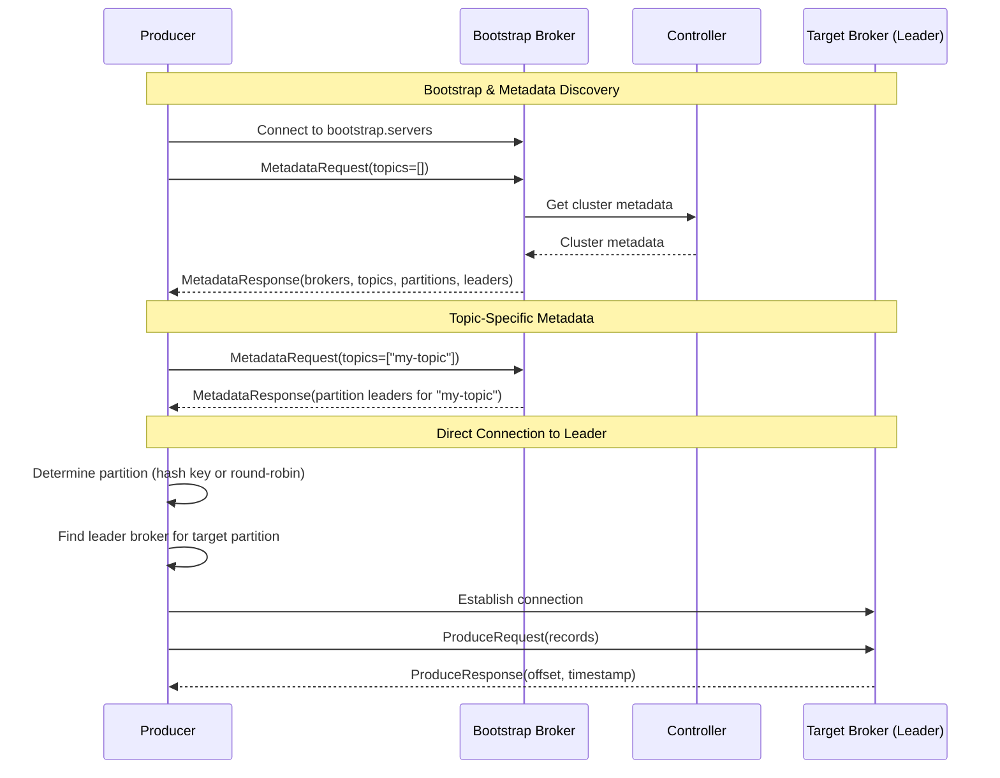

Apache Kafka is a distributed event streaming platform designed for high-throughput, fault-tolerant, real-time data streaming. It provides a unified, high-performance solution for handling real-time data feeds. Kafka is built to be horizontally scalable, reliably store massive amounts of data, and connect disparate data sources and sinks.

## full architecture

## replica management

create a topic with 3 partition and 2 replication factor, we will have a kafka cluster like this:

How did partitions get handled? there are two critical components: ReplicaManager and Partition.

`ReplicaManager` key responsibilities:

- manages local partition replicas
  - `protected val allPartitions = new ConcurrentHashMap[TopicPartition, HostedPartition]`
- handles log appends, fetches, truncations, and high watermark management
- coordinates with fetcher threads for replication from leaders to followers
  - `ReplicaFetcherManager`
- manages ISRs (in sync replica) set and triggerrs actions when replicas fall out of sync
  - startup() --> `scheduler.schedule("isr-expiration", () => maybeShrinkIsr(), 0L, config.replicaLagTimeMaxMs / 2)`
- handles partition leadership changes (role change) as directed by the controller
  - `becomeLeaderOrFollower`
- cleans up resources and metrics for partitions as needed

`Partition` Data structure that represents a topic partition.

the sequence diagram of creating new topic was as followed.

## group coordinating

Group coordination in KRaft mode handles consumer group membership, partition assignment, and offset management.

the workflow of partition assign.

## log management

the sequence diagram of create new log file.

the general log file types and the hierarchy.

log retention sequence

## silly questions

### what's the dataflow while client produces data (in kraft mode)

1. how did client know which broker to connect
   1. through metadata request
   2. maintain in local cache
   3. refresh if any error occurred
2. how the topic partition was handled, by client or broker
   1. if the topic partition was in client side, the requests would be maintained in local memory buffer and resided inside the broker-partition section to achieve batching (and the memory pool was shared across all broker connections)

## references

- https://deepwiki.com/apache/kafka
- https://kafka.apache.org/documentation/#gettingStarted
- https://github.com/apache/kafka
- [raft](https://raft.github.io/)
- 深入理解 Kafka -- 核心设计与实践原理
