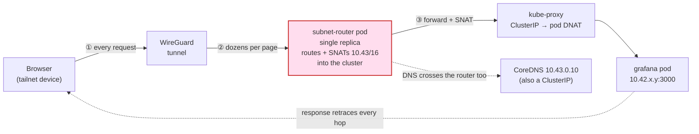
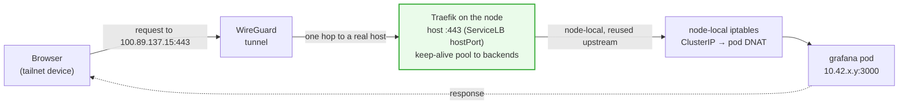

In [Boring Kubernetes](k3s-migration.md) I migrated 23 services from Docker Compose to a single-node K3s box, and ended the post with a smug list of things I *didn't* need. One of them was:

> **No fancy ingress** (Traefik/Nginx) — Tailscale + NodePort is enough.

Six months later, I've retired every NodePort and put a **Traefik ingress** in front of every interactive app. This is the story of why "enough" stopped being enough, and how the fix turned out to be code that was *already running on the cluster*.

## The itch: NodePort was fine, until it wasn't

The dual-access networking from last time worked. Tailscale Subnet Router for remote access via `*.svc.cluster.local`, NodePort for fast local streaming. But two annoyances compounded.

**Annoyance 1: NodePort is ugly.** Every service meant remembering a random high port:

```
http://192.168.1.100:30896  # Jellyfin — was it 896 or 968?
http://192.168.1.100:30453  # Navidrome
http://192.168.1.100:30500  # Kavita
```

No TLS, no names, no bookmarks that survive a service redeploy. Fine for a media app you open from a TV once. Miserable for a dashboard you open ten times a day.

**Annoyance 2: chatty HTTP over the subnet router felt sluggish.** The subnet router is great for what it is — raw TCP and low-volume admin access. But every packet to `grafana.harus-infrastructure.svc.cluster.local` took the **router hop**: client → Tailscale → subnet-router pod → CoreDNS → service. For a bulk `postgres:5432` connection you never notice. For an interactive app firing dozens of little XHRs per page, that hop adds up into a spinny, laggy feel even on the same WiFi.

I wanted one thing: type `grafana.h.azusachino.icu` into any device on my tailnet, get a green padlock, and have it feel like localhost.

## Anatomy of the slow path

Why did `grafana.harus-infrastructure.svc.cluster.local` feel sluggish when a raw `ping` to the node was ~2ms? Because both the *name* and the *address* it resolves to are **virtual cluster objects that only exist inside the node** — and the only way a tailnet device can reach them is by routing every packet through the single subnet-router pod.

Walk one dashboard click through the old path:



Three things conspire, and none of them show up in a `ping`:

1. **The destination is a ClusterIP, not a host.** `grafana` resolves to something like `10.43.x.y` — a virtual IP that lives only in the node's iptables. To reach it from outside, the subnet router advertises `10.43.0.0/16` over Tailscale, so packets are tunneled to the **subnet-router pod**, which forwards and SNATs them into the cluster network. That pod is an extra L3 hop *and* a single replica: every byte to every cluster service funnels through one pod's network stack (even with `TS_USERSPACE=false` it's a separate netns doing subnet routing, not host networking).
2. **DNS crosses the router too.** The split-DNS rule sends `*.cluster.local` to CoreDNS at `10.43.0.10` — itself a ClusterIP behind the router. So even resolving the name pays the hop tax before the first data packet moves.
3. **Interactive pages multiply it.** A `postgres:5432` bulk transfer opens one connection and streams — you never feel the hop. A Grafana page fires dozens of small, latency-sensitive requests, and each TCP + TLS handshake is several round-trips *before the first byte*. Multiply "one extra pod hop + SNAT + kube-proxy DNAT" across all of that and a dashboard that should feel instant has visible lag on every click.

The subnet router isn't broken — it's doing exactly what a router does. It's just the wrong tool for chatty, handshake-heavy HTTP. The fix is to stop making interactive traffic terminate at a virtual ClusterIP behind a forwarding pod.

## The realization: the ingress controller was already there

Here's the embarrassing part. When I wrote "no ingress controller," **I was wrong.** The K3s-bundled Traefik had been running in `kube-system` the entire time — I'd just never given it a single route.

> **Correction to my past self:** the cluster *does* have an ingress controller. The bundled Traefik was simply unused (zero routes).

That reframes the whole project. This wasn't "install and operate Traefik." It was "adopt something already running and exposed." No new Deployment, no Helm install, no operator. Just:

1. Teach DNS to point `*.h.azusachino.icu` at the node.
2. Give Traefik a trusted wildcard cert.
3. Drop an `IngressRoute` next to each service.

## How it's wired: killing the router hop

K3s ships Traefik as a `LoadBalancer` Service, and ServiceLB (the `svclb-traefik` DaemonSet) binds host ports **80/443** directly on the node. My node's tailnet IP is `100.89.137.15` — a *real* tailnet peer, not a ClusterIP. So the data path now terminates on the node's own host networking:



Same request, but look at what's gone:

- **The tunnel ends at a real host.** `100.89.137.15:443` is the node itself on the tailnet — one WireGuard hop to a genuine peer, no forwarding pod in the middle. The subnet-router pod is entirely off the hot path.
- **The last hop is node-local.** From the host, reaching the backend is a single in-node iptables DNAT (ClusterIP → pod) — microseconds, no tunnel, no SNAT through a second netns.
- **Traefik keeps connections warm.** It holds a keep-alive pool to each backend, so the per-request handshake cost that hurt most over the router path largely disappears — the browser handshakes once with Traefik over TLS, and Traefik reuses hot upstreams.

The division of labor is now clean:

- **Traefik** handles all HTTP/L7 — every interactive web app.
- **Subnet router** stays for raw TCP (`postgres:5432`) and `*.svc.cluster.local` admin/debug access — exactly the traffic that never minded the hop.
- **NodePorts** are retired entirely.

## DNS: one wildcard to rule them all

I don't want a DNS record per service. I want `*.h.azusachino.icu` to land on the Traefik entrypoint, and let Traefik sort out routing by `Host` header.

Two pieces make that work. First, K3s CoreDNS auto-imports custom server blocks from a ConfigMap, so I template the whole subdomain to the node's tailnet IP:

```yaml
# 01-infrastructure/traefik/coredns-custom.yaml
apiVersion: v1
kind: ConfigMap
metadata:
  name: coredns-custom
  namespace: kube-system
data:
  h-azusachino.server: |
    h.azusachino.icu {
      template IN A {
        answer "{{ .Name }} 60 IN A 100.89.137.15"
      }
      template IN AAAA {
        rcode NOERROR
      }
    }
```

Second, a **Tailscale split-DNS** rule (set once in the console) routes `h.azusachino.icu → 10.43.0.10`, the CoreDNS ClusterIP. Now any tailnet device resolving `grafana.h.azusachino.icu` gets `100.89.137.15`, hits Traefik, and Traefik matches the host.

Yes — that DNS lookup *still* crosses the subnet router to reach CoreDNS. The difference is it's a **once-per-name, 60-second-cached** cost, not a per-request one. The *data* path — the thousands of packets that interactive latency is actually made of — now goes straight to the host. That's the whole trade: keep the cheap thing on the router, move the expensive thing off it.

## TLS: real Let's Encrypt certs for tailnet-only hosts

This is the part I'm most pleased with. These hosts are **not publicly reachable** — they only exist on my tailnet. Normally that rules out Let's Encrypt, because HTTP-01 validation needs a public IP.

**DNS-01 doesn't.** It proves domain ownership by writing a TXT record via the Cloudflare API, which never requires the host itself to be reachable from the internet. So I get genuine, browser-trusted wildcard certs for hosts that live entirely behind Tailscale. No `mkcert`, no per-device CA trust, no "your connection is not private" clickthroughs.

I don't deploy my own Traefik to configure this — I deep-merge onto the bundled chart with a `HelmChartConfig`, which K3s's helm-controller layers on top of the chart's managed values:

```yaml
# 01-infrastructure/traefik/helmchartconfig.yaml
apiVersion: helm.cattle.io/v1
kind: HelmChartConfig
metadata:
  name: traefik
  namespace: kube-system
spec:
  valuesContent: |-
    persistence:
      enabled: true
      storageClass: local-path
      size: 128Mi
      path: /data
    # acme.json must be writable by the non-root traefik user (uid/gid 65532)
    podSecurityContext:
      fsGroup: 65532
      fsGroupChangePolicy: "OnRootMismatch"
    env:
      - name: CF_DNS_API_TOKEN
        valueFrom:
          secretKeyRef:
            name: traefik-cf-dns-token
            key: CF_DNS_API_TOKEN
    certificatesResolvers:
      le:
        acme:
          email: azusa146@gmail.com
          storage: /data/acme.json
          dnsChallenge:
            provider: cloudflare
            resolvers: ["1.1.1.1:53", "8.8.8.8:53"]
    # Default cert for websecure: one LE wildcard, served by SNI to any route.
    tlsStore:
      default:
        defaultGeneratedCert:
          resolver: le
          domain:
            main: h.azusachino.icu
            sans: ["*.h.azusachino.icu"]
```

Three details worth calling out:

- **`acme.json` on a `local-path` PVC.** Let's Encrypt rate limits are unforgiving. Persist the cert store so a Traefik restart doesn't re-issue and burn your quota.
- **`fsGroup: 65532`.** Traefik runs as a non-root user; without the right group ownership it can't write `acme.json` and silently fails to persist certs.
- **`defaultGeneratedCert`.** One wildcard cert serves *every* route by SNI match. No per-route resolver config — a route just says `tls: {}` and inherits the padlock.

The Cloudflare token is a `SealedSecret` (`traefik-cf-dns-token`), scoped to `Zone · DNS · Edit` on the zone — the minimum DNS-01 needs.

## Routing a service is now three lines of intent

With the plumbing done, adding a service is trivial. Drop an `IngressRoute` in the service's own directory (same namespace as its Service), listing both entrypoints and `tls: {}`:

```yaml
# 01-infrastructure/grafana/ingressroute.yaml
apiVersion: traefik.io/v1alpha1
kind: IngressRoute
metadata:
  name: grafana
  namespace: harus-infrastructure
spec:
  entryPoints: [web, websecure]
  routes:
    - match: Host(`grafana.h.azusachino.icu`)
      kind: Rule
      services:
        - name: grafana
          port: 80
  tls: {} # inherits the LE wildcard *.h.azusachino.icu
```

Apply it, and you can test the route *before* DNS has propagated by faking the `Host` header:

```sh
curl -H "Host: grafana.h.azusachino.icu" http://100.89.137.15/
```

That's the entire per-service cost now. Two dozen apps — Grafana, Immich, Jellyfin, Vaultwarden, Karakeep, n8n — all follow the identical pattern, each host `<name>.h.azusachino.icu`. Public exposure stays a separate, deliberate concern: only the Cloudflare Tunnel allowlist is reachable off-tailnet.

## The gotchas

- **Version is chart-managed.** The bundled Traefik tracks the K3s release (currently v3.6.x) and is *not* in my pinning discipline. A K3s upgrade can move it; I just record the observed version with a note rather than fighting it.
- **Split-DNS is a manual console step.** The `coredns-custom` half is in Git, but the Tailscale `h.azusachino.icu → 10.43.0.10` rule lives in the Tailscale admin console. Easy to forget when rebuilding.
- **DNS-01 needs the token in the right namespace.** The `SealedSecret` must land in `kube-system` (where Traefik runs), not the app namespace.

## Was it worth undoing my past self?

The old post's thesis was "boring is good — build it once, let it run." Adopting Traefik didn't betray that; it *extended* it. I didn't add a moving part — I lit up one that was already there and idle. The result is fewer things to remember, not more:

- ✅ Every app at a real name: `<service>.h.azusachino.icu`
- ✅ Green-padlock TLS everywhere, zero per-device trust, zero public exposure
- ✅ Interactive apps off the subnet-router data path — no more spinny dashboards
- ✅ NodePort port-roulette retired
- ✅ New service = one `IngressRoute` with `tls: {}`

The subnet router didn't go away — it's still the right tool for raw TCP and admin access. It just stopped being the tool for *everything*. That's the real lesson of a boring homelab: it's not that you never change it. It's that when you do, you reach for the thing already on the cluster before you install a new one.

## What's next

Traefik closed the *ingress* gap. Poking at the cluster afterward, the honest list of what's still missing is short — and, keeping with the boring rule, each item either lights up something already adoptable or plugs into a tool I already run (Grafana, Prometheus, the Git → ArgoCD loop). No new control planes.

Roughly in order of leverage:

1. **Alerting — Alertmanager → ntfy/Discord.** I have all these metrics and still no way to be *told* when Immich OOMs or a PVC fills. Highest-return single addition.
2. **Logs — Loki + Grafana Alloy.** The missing observability pillar. Grafana already runs, so Loki is just a datasource: click a metric spike, jump to the correlated logs. (Alloy, not the now-deprecated Promtail.)
3. **Automated updates — Renovate.** I run GitOps but still bump image tags by hand — the "update anxiety" from the first post, still not fully dead. Renovate opens PRs, ArgoCD syncs. This finally closes that loop.
4. **External uptime — Gatus.** Prometheus scrapes internals; it won't tell me a route returns 502 from the outside. Declarative YAML, so it fits the GitOps repo.

And the one deliberate fork off the "boring" path, filed under *someday, for the learning, not because it hurts*: going **multi-node HA** (three servers for real etcd quorum — two is worse than one) with **Longhorn** replacing local-path so storage survives a node dying. That one breaks the single-node thesis this whole series is built on, so it stays firmly at the bottom.

The full tiered version — with a dataflow diagram of where each piece plugs in — lives as a living `ROADMAP.md` in the cluster repo, so the plan is versioned next to the manifests instead of trapped in a blog post.

---

**TL;DR:** Retired NodePorts and put the K3s-bundled Traefik (previously running with zero routes) in front of every HTTP app. Wildcard DNS via `coredns-custom` + Tailscale split-DNS, real Let's Encrypt certs for tailnet-only hosts via Cloudflare DNS-01, one default wildcard cert inherited by every route with `tls: {}`. No subnet-router hop, no port-roulette, green padlocks everywhere. Adopting beats installing.
