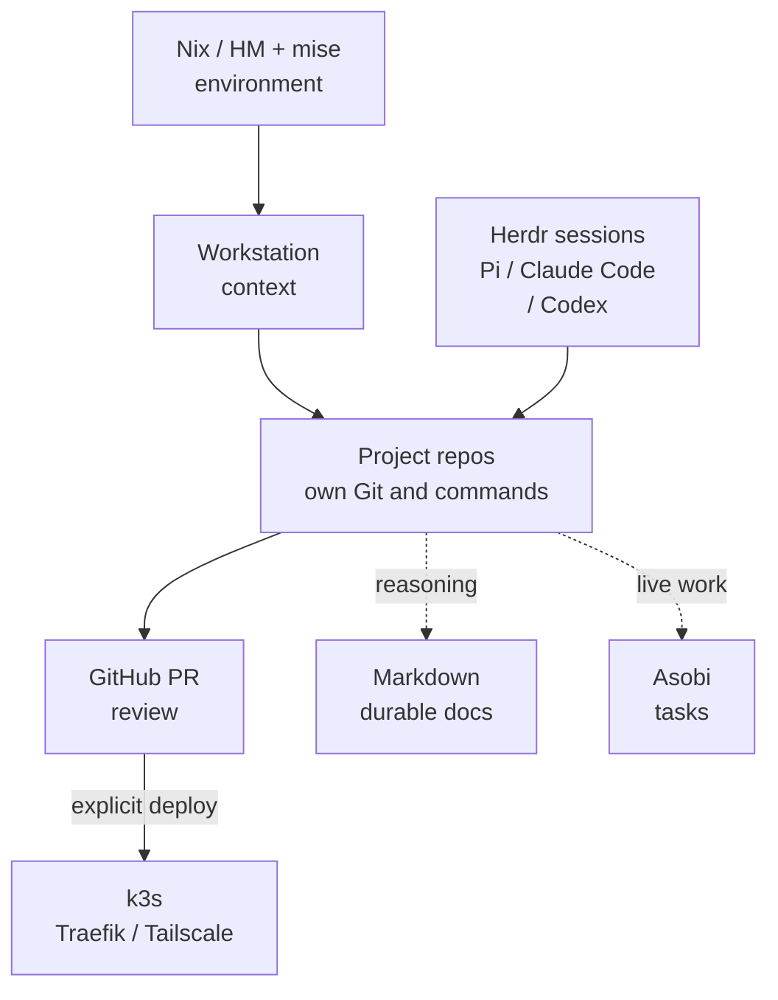
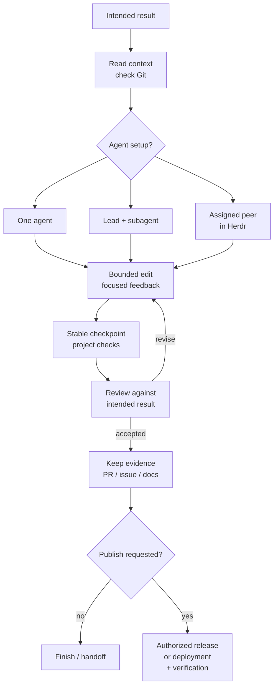

In my [September refresh](../../journal/posts/2026/refresh/month-refresh-2026-09.md), I described an uncomfortable gap: agent-assisted projects were moving quickly, while human verification and understanding struggled to keep up. More code was arriving. That did not mean I understood more of it.

The workstation grew out of that gap. I needed to return to a project and know what was happening without reconstructing its entire history. Along the way, I built some useful tools, adopted others, and removed machinery that made the work harder.

## TL;DR

I keep independent repositories in one workstation, use Nix/Home Manager for the configured machine environment, and let projects own their toolchains and checks. Markdown holds durable knowledge; Asobi carries live tasks; GitHub holds reviewed changes. Pi, Claude Code and Codex work inside that setup, with Herdr available for separate live sessions. A task can have one agent, bounded subagents or assigned peers. The price is explicit synchronization, handoffs and human review. Next, I want less coordination overhead, better end-to-end evidence, and a useful phone companion without handing it control of agent lifetimes.

<!-- more -->

## The pain: every project had a second job

The first job was building the application. The second was remembering how to work on it.

A change might start in an application, require a deployment change elsewhere, and touch shared configuration on another machine. The relevant decision could be in a Markdown file, a PR, a task graph or yesterday's agent conversation. A long conversation supplied context, but it also accumulated old assumptions. Opening another session meant figuring out which parts were still true.

Agents made this more visible. A plausible implementation could arrive before I had settled the acceptance criteria. A passing check could be presented as evidence for a behavior it had never exercised. I could spend the time saved on typing in a much longer review loop.

My response was initially to try more infrastructure. Wiki.js looked like a centralized authoring surface. The repository collection used submodules. Shared tool configuration seemed like something to put in the reusable Nix base. These choices all looked orderly. Each also introduced a place where ownership or synchronization could become ambiguous.

I wanted shared context across projects. I did not want every project to become dependent on a new central system just to read its instructions or run its tests.

## The decision: give the shared layer a smaller job

### Keep the knowledge close to the work

On September 24, I returned operational authoring to local Markdown after the Wiki.js experiment. The files already had search, Git diffs and build checks. Putting routine edits through a service added round trips and split the authoring path.

Today `docs/` in the workstation is harus-kb, rendered with Rspress. Project-specific contracts stay in the project. Apricot holds personal Markdown notes and journals; this blog uses MkDocs and Material. These are separate publication and ownership boundaries, even though all three use Markdown.

[Tsuzuri](https://github.com/azusachino/tsuzuri) provides a CLI and TypeScript SDK over the personal vault. It understands Obsidian links, tags and frontmatter without requiring the Obsidian application or a persistent index. Luna, my Telegram secretary built on Bun, grammY and Pi's embedding SDK, uses that interface to read and edit the vault. It leaves changes local for review.

This buys a direct authoring path and inspectable changes. It does not make synchronization disappear. An unpushed commit stays on its machine, and naming, filing and reviewing notes remain work someone has to do.

### Share a starting directory, not a release cycle

On September 29, I replaced the vendor submodules with ordinary independent clones. We had deliberately ignored their moving pointers because the catalog tracked branches. Maintaining a second set of pointers had no useful job.

The private `harus-workstation` repository now provides a catalog and a common entry point:

```text
harus-workstation/
  platform.toml        # catalog and project groups
  vendor/<project>/    # independent Git repositories
  refs/<category>/     # read-only source material for study
  docs/                # workstation and cross-project knowledge
  .agents/skills/      # reusable agent instructions
  .tmp/<task>/         # disposable investigation outputs
```

For a Felicia task, the context query is `make context NAMES="felicia" ASOBI=1`. It reports the checkout, instruction files and live task state. I then read the owning instructions and check the actual Git branch and revision.

Felicia still owns its Go, SQLite, Svelte and desktop workflow. The blog still owns its Python/MkDocs build. The workstation does not invent another build system above them.

The cost is deliberate: a root commit cannot reproduce every vendor checkout. Handoffs must record the actual project revisions. That is more useful to me than a parent pointer that nobody was keeping meaningful.

### Let configured applications keep their dependencies

The machine environment also needed a narrower boundary. My Home Manager configuration defines six profiles across macOS, Linux and WSL. The public [harus-config](https://github.com/azusachino/harus-config) base supplies reusable modules; a private consumer chooses devices and personal configuration.

The October 8 [changelog](https://github.com/azusachino/harus-config/blob/f95550740b74203c9ab5f9b898c33d6d8a84fb9c/CHANGELOG.md) records the revisions within that split. A broad Rust-CLI move to mise was followed by restoring application dependencies and shell integrations to Nix. Eza and Tokei were retained, and Yazi kept its supporting helpers. The initial exact-pin/global-lock approach was revised too.

[Version 0.5.0](https://github.com/azusachino/harus-config/releases/tag/v0.5.0) then moved global mise choices into the consumer. The shared base installs mise and shell integration; the consumer decides its global tools and trust roots. Projects choose their runtime versions and lock policy. Rust toolchains remain rustup-owned, and uv or the project's JavaScript package manager handles project dependencies.

I gave up the appeal of one installer owning everything. In return, a configured application can keep the dependencies its integrations need, while a standalone utility can have a different update policy.

The resulting stack looks like this. Arrows describe support and access, not an automatic orchestration service:

<figure markdown="1" aria-label="Workstation stack and ownership">



<figcaption>The shared workstation supports independently owned projects.</figcaption>
</figure>

## The trade-off: someone still has to coordinate

Local files and independent repos reduce central machinery. They also make it harder to hide unfinished coordination behind a dashboard.

[Asobi](https://github.com/azusachino/asobi) carries my live task state. It is a Rust CLI backed by SQLite, with an optional shared graph server. Small search/graph reads locate relevant entities; `show` loads their observation bodies. Current facts such as branch, commit and next action are separate from the historical trail.

That makes a handoff portable across sessions, provided it records the right facts. A task claim is ownership, not a process launch. A saved revision can go stale. Finished tasks expire, so durable decisions still need to move into an issue, PR or Markdown document.

The [Asobi 0.8.1 change](https://github.com/azusachino/asobi/pull/41), released September 29, captures the trade-off well. Remote-configured commands now fail during an outage rather than silently writing to a local fallback graph. Work can be blocked, but it no longer appears shared while updates are actually going into a disconnected copy.

### More agents can create more work

A second agent can bring a separate context and a useful role. It also brings an assignment, a result to reconcile, and possibly another writer in the same checkout. Adding agents before defining that role just multiplies exploration.

I distinguish three arrangements:

- **One agent owns the task.** It investigates, edits and runs checks, then gives me a reviewable result. This is enough for a bounded task such as researching and writing this article.
- **A harness subagent answers a separable question.** For example, it can inspect a dependency while the lead handles the change. Its context, tools and filesystem isolation depend on the harness. A separate conversation alone does not guarantee independence.
- **A Herdr peer has a separate live session.** [Herdr](https://herdr.dev) can address a named agent, submit work, read its output and wait for a reported state. It helps when a role needs its own visible session or explicitly assigned repository. Separate panes still do not make concurrent writes to one checkout safe.

Even this article exposed a mismatch in the written workflow. The agent began setting up a separate researcher because the instructions said to delegate broad exploration. I had assigned the blog task to one agent and intended to review it myself. I asked it to finish that task and leave workflow refinement until afterward.

I want agent count to follow the assignment. A policy that makes every task a team exercise creates coordination overhead before it has demonstrated a benefit.

## The result: a loop I can inspect

There are concrete results behind this setup. Tsuzuri [0.8.0](https://github.com/azusachino/tsuzuri/releases/tag/v0.8.0) shipped file operations, permission masks and optional vault extensions. Asobi 0.8.1 shipped the explicit remote boundary. The shared Nix base now has a clearer consumer seam.

Running services add another boundary. The homelab uses a single-node k3s cluster, Tailscale for private access and Traefik for HTTP routing. Own-source images can be built locally and imported into the node's containerd. That avoids a registry-distribution problem on one node, while keeping the limitation obvious: a single node does not provide distributed availability. A reviewed source change still needs a separately authorized rollout and runtime check.

The same division is appearing in applications. Felicia's [agent intake change](https://github.com/azusachino/felicia/pull/167) feeds a local workspace through its CLI. The human reviews candidates and authors essays in the desktop studio; explicit publication produces a static reader. A fast importer should not decide which memories deserve an essay.

For an ordinary development task, I can now follow a change from request to review without making the agent transcript the only record:

<figure markdown="1" aria-label="A task from request to reviewed result">



<figcaption>A task from request to review, with publication as a separate decision.</figcaption>
</figure>

That loop is a working shape, not a guarantee that every task follows it correctly. It also costs time: someone must define the result, inspect what the tests prove, and review the actual artifact.

Recent CI changes reduce some unrelated repetition. [Tsuzuri](https://github.com/azusachino/tsuzuri/pull/124) gives documentation-only PRs a Markdown/spelling lane while pushes to `main` run the full Node matrix and smoke checks. [Felicia](https://github.com/azusachino/felicia/pull/169) also adopted path-aware CI. These changes alter check selection; they do not establish a measured productivity gain.

The verification work has supplied less flattering results too. Tsuzuri's 0.8.0 release notes record twenty rejection assertions that previously lacked `await`. A passing test run had not actually checked them. In Felicia, headless desktop-composition tests cover useful behavior without driving the native Wails window. Native acceptance remains a separate question.

My first draft of this article also passed the build and GitHub CI. I rejected it because it read like an internal manual and had no TL;DR. Those checks did their job: the Markdown and site built. They could not decide whether the article had a reason to exist.

I can point to better-separated responsibilities and shipped capabilities. I cannot honestly claim a measured reduction in my review burden yet.

## What I want to develop next

### Refine the workflow around the actual task

The next workflow revision should make the assignment and reviewer explicit without demanding multiple agents by default. I want fewer repeated instructions and fewer handoffs whose only purpose is satisfying a process.

A useful test would be whether another session can resume a real task from its recorded checkout, next action and evidence without reconstructing the old conversation. Counting new rules or spawned agents would tell me very little. That refinement is separate work; writing this post does not change the contract underneath it.

### Finish useful journeys, not just more components

Felicia has CLI intake, a local authoring workspace and static publication. I want the collection-to-publication journey to feel coherent, including the native interactions that headless checks cannot prove. A merged component or another green fixture should not become shorthand for that whole experience.

For the workstation, the equivalent is a reviewable end-to-end result: the exact artifact, its provenance, the behavior checked, and the limits of the evidence. Faster focused feedback helps only if the final acceptance remains meaningful.

### Make the phone a companion to existing agents

[Cappuccino](https://github.com/azusachino/cappuccino) is the next interface experiment: native Apple and Android clients for agent sessions that already exist in Herdr. The intended payoff is being able to inspect a conversation and understand where attention is needed away from the desk, without a phone client launching or replacing the agent.

The [current source](https://github.com/azusachino/cappuccino/blob/36f3afecb26e65fe2c3be12c42b4b64f52aef3e5/README.md) contains native clients and read-only bridge routes, but explicitly leaves prompt delivery and approvals unimplemented. Canonical live Pi transcript/stream behavior remains unverified. I want reconnection and session identity to be reliable before describing this as remote control that works.

That work adds another interface and another failure surface. It earns its place only if checking on an existing task becomes easier without changing that task's lifetime or authority.

### Improve recall only when retrieval actually fails

Tsuzuri currently works directly on files, with an in-memory scan. Its [later roadmap](https://github.com/azusachino/tsuzuri/blob/ae27321d47360549788bb5d8cec5bcfd21daf91e/docs/roadmap.md) leaves a derived cache and local multilingual embeddings conditional on real use cases and measurements.

That is a direction worth keeping. A slow cold load can justify a disposable cache; repeated Chinese recall failures can justify semantic retrieval. Neither should turn a derived store into the authority for the notes. I want better access to what I already know before building another knowledge system.

The workstation is still being developed through these frictions. Its useful output should be work I understand and can review, with enough context left for the next session. If the machinery starts consuming more attention than it returns, another round of subtraction is warranted.

## References

- [Monthly refresh, September 2026](../../journal/posts/2026/refresh/month-refresh-2026-09.md): the original reflection on agent velocity, verification and understanding.
- [harus-config changelog](https://github.com/azusachino/harus-config/blob/f95550740b74203c9ab5f9b898c33d6d8a84fb9c/CHANGELOG.md): the tool-ownership reversals, including the global mise boundary in 0.5.0.
- [Asobi 0.8.1 PR](https://github.com/azusachino/asobi/pull/41): fail-closed remote behavior, target reporting and the limits of its verification.
- [Tsuzuri 0.8.0 release](https://github.com/azusachino/tsuzuri/releases/tag/v0.8.0): file operations, host permission masks, portable runtime checks and the corrected assertions.
- [Felicia's agent-and-desktop workflow](https://github.com/azusachino/felicia/blob/693862a776281341672bbf8c6c42ba2c03409ba8/docs/research/agent-and-desktop-workflow.md): the proposed design narrative separating headless intake from human visual authoring; the implemented intake change is linked above.
- [Herdr](https://herdr.dev): the terminal/session layer behind the peer arrangement.
- [Home Manager](https://nix-community.github.io/home-manager/) and [mise](https://mise.jdx.dev/): the underlying environment and toolchain systems.
- [Cappuccino README](https://github.com/azusachino/cappuccino/blob/36f3afecb26e65fe2c3be12c42b4b64f52aef3e5/README.md): current companion implementation and its unverified or unfinished boundaries.
